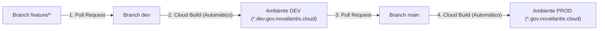

# Guia de Onboarding — Como Integrar Módulos e Demos ao Portal Novatlantis

Este guia apresenta o passo a passo completo para conectar uma aplicação ou demonstração existente ao ecossistema **Novatlantis**, entender a estrutura dos repositórios e publicar alterações através do pipeline de CI/CD.

---

## 1. Estrutura dos Repositórios e Ambientes

O projeto está dividido em 3 repositórios na organização `LATAM-PS-CE-Team`:

| Repositório | Função Principal |Quando alterar? |
| :--- | :--- | :--- |
| **[`novatlantis-app`](https://github.com/LATAM-PS-CE-Team/novatlantis-app)** | Portais (`landing-portal`, `citizen-portal`, `gov-backstage`), agente (`first-responder-agent`) e módulos setoriais (`apps/*`). | **Sempre que for adicionar ou atualizar uma demo/módulo.** |
| **[`novatlantis-iac`](https://github.com/LATAM-PS-CE-Team/novatlantis-iac)** | Infraestrutura Terraform (VPC, Load Balancer HTTPS global, certificados SSL, Cloud DNS, Cloud Run, AlloyDB e IAM). | Apenas quando precisar registrar um novo subdomínio público (`*.gov.novatlantis.cloud`) no DNS/certificado SSL. |
| **[`novatlantis-data-platform`](https://github.com/LATAM-PS-CE-Team/novatlantis-data-platform)** | Data Lakehouse no BigQuery, buckets Cloud Storage e gerador da base sintética de 100.000 cidadãos (`NID`). | Quando precisar adicionar novas tabelas analíticas ou datasets no BigQuery. |

### Ambientes Publicados

- **Produção (branch `main`):**
  - Portal Principal: [`https://gov.novatlantis.cloud`](https://gov.novatlantis.cloud)
  - Portal do Cidadão: [`https://portal.gov.novatlantis.cloud`](https://portal.gov.novatlantis.cloud)
  - Backstage Governamental: [`https://backstage.gov.novatlantis.cloud`](https://backstage.gov.novatlantis.cloud)
- **Desenvolvimento (branch `dev`):**
  - Portal Principal: [`https://dev.gov.novatlantis.cloud`](https://dev.gov.novatlantis.cloud)
  - Portal do Cidadão: [`https://portal.dev.gov.novatlantis.cloud`](https://portal.dev.gov.novatlantis.cloud)
  - Backstage Governamental: [`https://backstage.dev.gov.novatlantis.cloud`](https://backstage.dev.gov.novatlantis.cloud)

---

## 2. Como Funciona a Integração de Módulos (`@novatlantis/portal-sdk`)

Qualquer módulo adicionado em `apps/<id-do-modulo>/` contendo dois arquivos (`novatlantis.app.json` e `plugin.mjs`) é descoberto automaticamente pelo SDK do portal e integrado em **4 pontos simultâneos**:

1. **Catálogo da Página Inicial (`landing-portal`):** exibe o card do seu sistema com título, órgão responsável, tag de subdomínio e botões de acesso.
2. **Atendimento Digital / Chat (`POST /api/orchestrator/chat`):** quando o usuário digita qualquer palavra-chave definida em `triggerKeywords`, o chat aciona o seu `plugin.mjs` e retorna a resposta contextualizada com link direto para a sua aplicação.
3. **Portal do Cidadão (`citizen-portal`):** cria uma aba própria no menu lateral com indicadores (KPIs), registros e botões de ação.
4. **Backstage Governamental (`gov-backstage`):** cria uma fila operacional no painel administrativo para servidores públicos autenticados.

Você pode integrar seu caso de uso de duas formas:
- **Modo 1 — Demo Federada (Recomendado para demos já prontas):** sua aplicação continua rodando no seu próprio projeto Google Cloud (Cloud Run, GKE, etc.), e o Portal Novatlantis funciona como vitrine unificada, roteador de chat e redirecionador de subdomínio (`<sua-demo>.gov.novatlantis.cloud`).
- **Modo 2 — Módulo Nativo com Banco de Dados Local/AlloyDB:** além do manifesto e plugin, seu módulo persiste tabelas transacionais no banco do portal (como em `apps/justice-court-tj`).

---

## 3. Passo a Passo: Dando o Primeiro Passo (Em 10 Minutos)

### Passo 1 — Clonar o repositório e criar sua branch a partir de `dev`

```bash
git clone https://github.com/LATAM-PS-CE-Team/novatlantis-app.git
cd novatlantis-app
git checkout dev
git pull origin dev
git checkout -b feature/minha-demo
```

### Passo 2 — Gerar o esqueleto do módulo automaticamente

Execute o gerador de módulos passando o identificador (`--id`), título (`--title`), órgão (`--agency`) e sigla (`--owner`):

```bash
npm run create:app -- \
  --id=sefaz-tributos \
  --title="SEFAZ Digital — Gestão Tributária" \
  --agency="Secretaria da Fazenda" \
  --owner="SEFAZ" \
  --sector="TAX_ADMINISTRATION"
```

Isso criará a pasta `apps/sefaz-tributos/` com:
- `novatlantis.app.json` (manifesto declarativo em Português, Espanhol e Inglês)
- `plugin.mjs` (lógica de resposta do chat, indicadores e visão do cidadão/backstage)
- `package.json`, `server.js` e `Dockerfile`

### Passo 3 — Conectar sua Demo Federada no `novatlantis.app.json`

Abra `apps/<seu-id>/novatlantis.app.json` e adicione os campos `externalTargetUrl` (URL pública da sua demo no Cloud Run/GKE) e `federatedSubdomain` (subdomínio desejado), além de ajustar as palavras-chave (`triggerKeywords`) que ativam sua demo no chat:

```json
{
  "appId": "sefaz-tributos",
  "version": "1.0.0",
  "owner": "SEFAZ",
  "sector": "TAX_ADMINISTRATION",
  "externalTargetUrl": "https://minha-demo-sefaz-123456.southamerica-east1.run.app",
  "federatedSubdomain": "sefaz",
  "landingCatalog": {
    "enabled": true,
    "icon": "AccountBalance",
    "badge": "SEFAZ • TRIBUTOS",
    "title": {
      "pt-BR": "SEFAZ Digital — Gestão Tributária",
      "es-419": "SEFAZ Digital — Gestión Tributaria",
      "en-US": "Digital Tax Administration (SEFAZ)"
    },
    "agency": {
      "pt-BR": "Secretaria da Fazenda",
      "es-419": "Secretaría de Hacienda",
      "en-US": "Department of Revenue"
    },
    "description": {
      "pt-BR": "Auditoria fiscal, emissão de guias e consulta de regularidade tributária.",
      "es-419": "Auditoría fiscal, emisión de guías y consulta de regularidad tributaria.",
      "en-US": "Tax auditing, payment slip issuance, and tax compliance lookup."
    },
    "questionPrompt": {
      "pt-BR": "Como funciona o sistema da SEFAZ Digital?",
      "es-419": "¿Cómo funciona el sistema de SEFAZ Digital?",
      "en-US": "How does the Digital Tax Administration system work?"
    },
    "servicePrompt": {
      "pt-BR": "Acessar o sistema da SEFAZ Digital",
      "es-419": "Acceder al sistema de SEFAZ Digital",
      "en-US": "Open the Digital Tax Administration system"
    }
  },
  "agentIntegration": {
    "agentId": "agent-sefaz-tributos-v1 (SEFAZ)",
    "triggerKeywords": ["sefaz", "icms", "nota fiscal", "auditoria fiscal"],
    "executeEndpoint": "/api/v1/apps/sefaz-tributos/agent",
    "requiresAuthForTransaction": false
  }
}
```

> **Exemplos prontos no repositório para consulta:**
> - Demos federadas externas: `apps/multaexec-mprs/`, `apps/vigia-mprs/`, `apps/geo-engine-car/`, `apps/detran-blockchain/`
> - Módulo nativo completo com banco de dados: `apps/justice-court-tj/`

### Passo 4 — Sincronizar com os Portais e Testar Localmente

Para que os containers Docker do `landing-portal`, `citizen-portal` e `gov-backstage` empacotem o novo manifesto em produção, copie a pasta do seu módulo para o diretório `pluggable-apps` de cada portal:

```bash
for portal in landing-portal citizen-portal gov-backstage; do
  mkdir -p apps/$portal/pluggable-apps/sefaz-tributos
  cp apps/sefaz-tributos/novatlantis.app.json apps/sefaz-tributos/plugin.mjs apps/$portal/pluggable-apps/sefaz-tributos/
done
```

Para validar o manifesto e testar localmente:

```bash
npm --prefix apps/sefaz-tributos test
npm --prefix apps/landing-portal run build
PORT=8080 node apps/landing-portal/server.mjs
```

Acesse `http://localhost:8080/api/v1/registry/apps` para confirmar que seu módulo aparece registrado no JSON.

### Passo 5 (Opcional) — Ativar Redirecionamento por Subdomínio (`<subdominio>.gov.novatlantis.cloud`)

Se quiser que `https://sefaz.gov.novatlantis.cloud` redirecione automaticamente para a URL da sua demo:
1. Em `novatlantis-app/apps/landing-portal/server.mjs`, adicione a chave no objeto `FEDERATED_SUBDOMAIN_TARGETS`:
   ```javascript
   const FEDERATED_SUBDOMAIN_TARGETS = {
     multaexec: 'https://multaexec-ia-demo-633153854135.southamerica-east1.run.app/#/dashboard',
     vigia: 'https://vigia-ia-demo-633153854135.southamerica-east1.run.app/#/visao-geral',
     geo: 'https://geo-engine-app-345748407347.us-central1.run.app/',
     detran: 'https://material.136.81.200.203.nip.io/pn44detran',
     sefaz: 'https://minha-demo-sefaz-123456.southamerica-east1.run.app'
   };
   ```
2. Caso precise do certificado SSL e DNS para o novo subdomínio no Load Balancer global, adicione o subdomínio na lista de domínios em `novatlantis-iac/main.tf`.

---

## 4. Fluxo do Pipeline CI/CD e Governança de Branches

As branches `dev` e `main` são protegidas e utilizam **autenticação sem chaves (Workload Identity Federation + Cloud Build)**:



1. **Abra um Pull Request da sua branch `feature/*` para `dev`:**
   ```bash
   git add .
   git commit -m "feat(apps): adiciona módulo federado sefaz-tributos"
   git push -u origin feature/minha-demo
   ```
2. **Validação Automática e Deploy em `dev`:**
   - O GitHub Actions valida a sintaxe de todos os manifestos `novatlantis.app.json` e o build dos portais.
   - Assim que o PR é aprovado e mesclado em `dev`, o Cloud Build constrói as imagens no Artifact Registry e atualiza os serviços `novatlantis-dev-*` em [`https://dev.gov.novatlantis.cloud`](https://dev.gov.novatlantis.cloud).
3. **Promoção para Produção (`main`):**
   - Após testar sua integração em `dev.gov.novatlantis.cloud`, abra um Pull Request da branch `dev` para `main`.
   - Com o merge em `main`, o Cloud Build atualiza automaticamente o ambiente de produção em [`https://gov.novatlantis.cloud`](https://gov.novatlantis.cloud).
