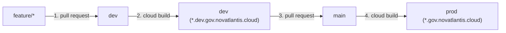

# novatlantis onboarding

Step-by-step guide to request repository access, connect a federated demo to **Novatlantis** (`gov.novatlantis.cloud`), and ship changes through the CI/CD pipeline.

## github access

If you do not have a GitHub account or write access to the organization yet:

1. **create a github account:** sign up at [`https://github.com/signup`](https://github.com/signup) and enable Two-Factor Authentication (2FA).
2. **join the organization:** send your GitHub username to the project maintainers (`@pedrocalixto` or `@billebr`) to be invited to [`LATAM-PS-CE-Team`](https://github.com/LATAM-PS-CE-Team), then accept the invite at [`https://github.com/orgs/LATAM-PS-CE-Team/invitation`](https://github.com/orgs/LATAM-PS-CE-Team/invitation).
3. **authenticate git locally:** run the GitHub CLI authentication flow so your terminal can push branches:
   ```bash
   gh auth login
   # Select: GitHub.com -> HTTPS -> Yes (authenticate Git with credentials) -> Login with a web browser
   ```
   *(Alternatively, configure an SSH key or a Personal Access Token with `repo` permissions).*
4. **set your git identity:**
   ```bash
   git config --global user.name "Your Name"
   git config --global user.email "your-email@example.com"
   ```

## repositories

The platform is split across 3 repositories in [`LATAM-PS-CE-Team`](https://github.com/LATAM-PS-CE-Team):

| Repository | Scope | When to touch |
| :--- | :--- | :--- |
| **[`novatlantis-app`](https://github.com/LATAM-PS-CE-Team/novatlantis-app)** | Web portals (`landing-portal`, `citizen-portal`, `gov-backstage`), `first-responder-agent`, and pluggable modules (`apps/*`). | **Whenever you add or update a demo or module.** |
| **[`novatlantis-iac`](https://github.com/LATAM-PS-CE-Team/novatlantis-iac)** | Terraform infrastructure (VPC, global HTTPS Load Balancer, SSL certificates, Cloud DNS, Cloud Run, AlloyDB, IAM). | Only when registering a new public subdomain (`*.gov.novatlantis.cloud`) in DNS/SSL. |
| **[`novatlantis-data-platform`](https://github.com/LATAM-PS-CE-Team/novatlantis-data-platform)** | BigQuery datasets, Cloud Storage buckets, and the 100,000 synthetic citizen generator (`NID`). | When adding shared BigQuery tables or analytical views. |

### environments

- **production (`main`):**
  - main portal: [`https://gov.novatlantis.cloud`](https://gov.novatlantis.cloud)
  - citizen portal: [`https://portal.gov.novatlantis.cloud`](https://portal.gov.novatlantis.cloud)
  - government backstage: [`https://backstage.gov.novatlantis.cloud`](https://backstage.gov.novatlantis.cloud)
- **development (`dev`):**
  - main portal: [`https://dev.gov.novatlantis.cloud`](https://dev.gov.novatlantis.cloud)
  - citizen portal: [`https://portal.dev.gov.novatlantis.cloud`](https://portal.dev.gov.novatlantis.cloud)
  - government backstage: [`https://backstage.dev.gov.novatlantis.cloud`](https://backstage.dev.gov.novatlantis.cloud)

## how integration works

Every folder inside `apps/<app-id>/` containing `novatlantis.app.json` and `plugin.mjs` is automatically discovered by `@novatlantis/portal-sdk` and wired into **4 surfaces**:

1. **home catalog (`landing-portal`):** displays your card with title, agency, subdomain tag, and launch buttons.
2. **digital assistant (`POST /api/orchestrator/chat`):** matches any keyword in `triggerKeywords`, runs your `plugin.mjs`, and returns a contextual reply with a direct link to your app.
3. **citizen portal (`citizen-portal`):** adds a dedicated tab in the side navigation with KPIs, records, and actions.
4. **government backstage (`gov-backstage`):** adds an operational queue for authenticated public servants.

You can integrate in two modes:
- **federated demo (recommended for existing demos):** your application stays hosted in your own Google Cloud project (Cloud Run, GKE, etc.), and Novatlantis acts as the unified catalog, chat router, and subdomain redirect (`<your-demo>.gov.novatlantis.cloud`).
- **native module:** your module runs inside the portal's stack and persists tables in the local SQLite / AlloyDB database (like `apps/justice-court-tj`).

## quickstart

### 1. clone and branch

Always branch off `dev`:

```bash
git clone https://github.com/LATAM-PS-CE-Team/novatlantis-app.git
cd novatlantis-app
git checkout dev
git pull origin dev
git checkout -b feature/my-demo
```

### 2. generate the module

Run the scaffolding script with your module ID, title, agency, and owner acronym:

```bash
npm run create:app -- \
  --id=sefaz-tax \
  --title="Digital Tax Administration" \
  --agency="Department of Revenue" \
  --owner="SEFAZ" \
  --sector="TAX_ADMINISTRATION"
```

This creates `apps/sefaz-tax/` with:
- `novatlantis.app.json` (manifest in Portuguese, Spanish, and English)
- `plugin.mjs` (chat handler, KPIs, and citizen/backstage views)
- `package.json`, `server.js`, and `Dockerfile`

### 3. link your demo

Open `apps/<your-id>/novatlantis.app.json` and set `externalTargetUrl` (your public Cloud Run/GKE URL), `federatedSubdomain`, and `triggerKeywords`:

```json
{
  "appId": "sefaz-tax",
  "version": "1.0.0",
  "owner": "SEFAZ",
  "sector": "TAX_ADMINISTRATION",
  "externalTargetUrl": "https://my-tax-demo-123456.southamerica-east1.run.app",
  "federatedSubdomain": "sefaz",
  "landingCatalog": {
    "enabled": true,
    "icon": "AccountBalance",
    "badge": "SEFAZ • TAX",
    "title": {
      "pt-BR": "SEFAZ Digital — Gestão Tributária",
      "es-419": "SEFAZ Digital — Gestión Tributaria",
      "en-US": "Digital Tax Administration (SEFAZ)"
    },
    "agency": {
      "pt-BR": "Secretaria da Fazenda",
      "es-419": "Secretaría de Hacienda",
      "en-US": "Department of Revenue"
    },
    "description": {
      "pt-BR": "Auditoria fiscal, emissão de guias e consulta de regularidade tributária.",
      "es-419": "Auditoría fiscal, emisión de guías y consulta de regularidad tributaria.",
      "en-US": "Tax auditing, payment slip issuance, and tax compliance lookup."
    },
    "questionPrompt": {
      "pt-BR": "Como funciona o sistema da SEFAZ Digital?",
      "es-419": "¿Cómo funciona el sistema de SEFAZ Digital?",
      "en-US": "How does the Digital Tax Administration system work?"
    },
    "servicePrompt": {
      "pt-BR": "Acessar o sistema da SEFAZ Digital",
      "es-419": "Acceder al sistema de SEFAZ Digital",
      "en-US": "Open the Digital Tax Administration system"
    }
  },
  "agentIntegration": {
    "agentId": "agent-sefaz-tax-v1 (SEFAZ)",
    "triggerKeywords": ["sefaz", "tax", "icms", "invoice", "audit"],
    "executeEndpoint": "/api/v1/apps/sefaz-tax/agent",
    "requiresAuthForTransaction": false
  }
}
```

> **Note:** Reference implementations in the repository:
> - Federated demos: `apps/multaexec-mprs/`, `apps/vigia-mprs/`, `apps/geo-engine-car/`, `apps/detran-blockchain/`
> - Native module with database: `apps/justice-court-tj/`

### 4. sync and test

Copy your manifest and plugin into the `pluggable-apps/` folder of the three portals so their Docker images bundle your module:

```bash
for portal in landing-portal citizen-portal gov-backstage; do
  mkdir -p apps/$portal/pluggable-apps/sefaz-tax
  cp apps/sefaz-tax/novatlantis.app.json apps/sefaz-tax/plugin.mjs apps/$portal/pluggable-apps/sefaz-tax/
done
```

Validate the manifest and test locally:

```bash
npm --prefix apps/sefaz-tax test
npm --prefix apps/landing-portal run build
PORT=8080 node apps/landing-portal/server.mjs
```

Open `http://localhost:8080/api/v1/registry/apps` to verify your module is registered.

### 5. custom subdomain (optional)

If you want `https://sefaz.gov.novatlantis.cloud` to redirect to your demo URL:
1. Add your subdomain key to `FEDERATED_SUBDOMAIN_TARGETS` in `apps/landing-portal/server.mjs`:
   ```javascript
   const FEDERATED_SUBDOMAIN_TARGETS = {
     multaexec: 'https://multaexec-ia-demo-633153854135.southamerica-east1.run.app/#/dashboard',
     vigia: 'https://vigia-ia-demo-633153854135.southamerica-east1.run.app/#/visao-geral',
     geo: 'https://geo-engine-app-345748407347.us-central1.run.app/',
     detran: 'https://material.136.81.200.203.nip.io/pn44detran',
     sefaz: 'https://my-tax-demo-123456.southamerica-east1.run.app'
   };
   ```
2. Add the subdomain to the managed SSL certificate and DNS records in `novatlantis-iac/main.tf`.

## ci/cd pipeline

Both `dev` and `main` branches use keyless authentication (**Workload Identity Federation + Cloud Build**):



1. **push your branch and open a pull request to `dev`:**
   ```bash
   git add .
   git commit -m "feat(apps): add sefaz-tax federated module"
   git push -u origin feature/my-demo
   ```
2. **automatic validation and deploy to `dev`:**
   - GitHub Actions validates all `novatlantis.app.json` manifests and portal builds.
   - Once merged into `dev`, Cloud Build builds the affected images and updates `novatlantis-dev-*` at [`https://dev.gov.novatlantis.cloud`](https://dev.gov.novatlantis.cloud).
3. **promote to `main` (production):**
   - After verifying your demo in `dev.gov.novatlantis.cloud`, open a Pull Request from `dev` to `main`.
   - Merging into `main` triggers Cloud Build to deploy to [`https://gov.novatlantis.cloud`](https://gov.novatlantis.cloud).
